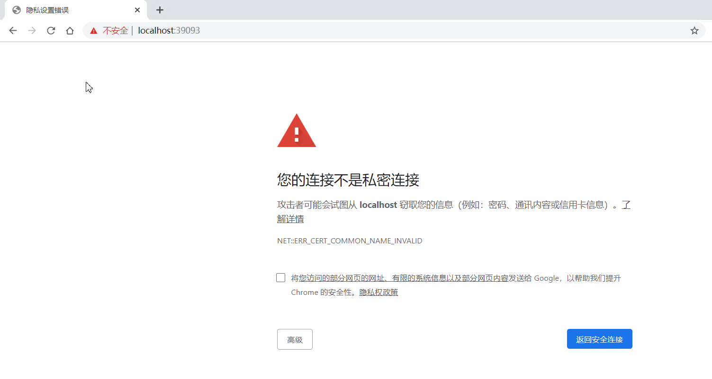

# Python代码运行助手

本程序为个人以前的作品,代码可能略显粗糙,不足之处请多包涵😅😅!若发现打码中的Bug还请指正。

本程序源自于[廖雪峰的Python教程中的Python代码运行助手](https://www.liaoxuefeng.com/wiki/1016959663602400/1018877595088352)本人对功能及界面做了一些加强，运行learning.py文件(Windows系统下可以直接双击run.bat运行，python版本需要大于3.6)后即可使用。

#### 可能出现的问题  

1. 无法连接到Python代码运行助手

   第一次使用时若出现该情况，请先打开https://localhost:39093/，若出现如下页面

   

   请依次点击`高级`>>`继续前往localhost（不安全）`，即可排除问题。

2. This learning.py is expired. Please download a newer version.

   本代码learning.py文件源自于廖雪峰的Python代码运行助手，若运行时出现该提示，请前往更新[learning.py](https://www.liaoxuefeng.com/wiki/1016959663602400/1018877595088352)文件。

#### 目录结构

Python代码运行助手
│  index.html
│  learning.py
│  README.md
│  run.bat
│
├─css
│      style.css
│
├─fonts
│      fontawesome-webfont.eot
│      fontawesome-webfont.svg
│      fontawesome-webfont.ttf
│      fontawesome-webfont.woff
│      fontawesome-webfont.woff2
│      FontAwesome.otf
│
├─images
│  └─README
│          image-20200116194439895.png
│
├─img
│      favicon.ico
│
├─js
│      app.js
│